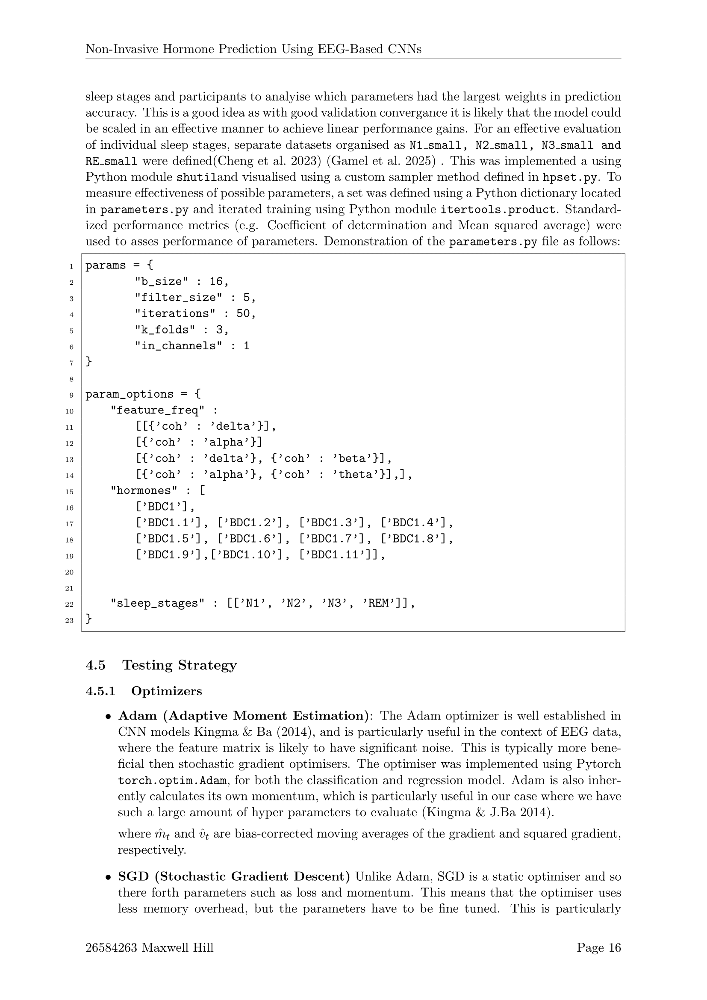

### Final Dissertation

[![Contributors][contributors-shield]][contributors-url]
[![MIT License][license-shield]][license-url]
[![LinkedIn][linkedin-shield]][linkedin-url]

<!-- PROJECT LOGO -->
 

  <h3 align="center">Final Dissertation</h3>

  EEG Based Biomarker prediction using Deep Learning
   
  <a href="https://github.com/max-hill-4/uni-twitter-analysis/tree/main/docs"><strong>Explore the docs »</strong></a>
   
   
  
   
  <a href="https://eeg.maxh.work/">View Demo</a>
  ·
  <a href="https://github.com/max-hill-4/uni-project/issues">Report Bug</a>

<!-- ABOUT THE PROJECT -->
## About The Project

This study aims to predict sleep-related hormone levels utilizing electroencephalogram (EEG)
data. This could be an effective alternative, as it would provide a less invasive means of capturing
vital biomarkers than blood sampling methods. Deep learning has proven to be very useful in
means of EEG analysis, specifically by utilizing Convolutional Neural Networks (CNNs) we could
correlate key hormones such as cortisol and testosterone. This approach eliminates the need for
frequent blood draws as model prediction could be done in real-time, allowing for continuous
hormonal sampling. Significant findings could have a meaningful effect for endocrine research.
Hormone Regression in Sleep The first iteration of the model included all four sleep stages
in its traning set, and a single output layer to predict regression values for all 12 hormones
(TAC mmol/L, ADA U/L, ADA2 U/L, %ADA2, GLU mg/Dl, PHOS mg/Dl, CA mg/Dl,
CHOL mg/Dl, TRI mg/Dl, HDL mg/dL, LDL-C mg/Dl, CPK U/L) at once. This was very
challenging, as the model struggled to converge on all 12 labels at the same time. The model’s
input being a 19x19 square matrix, originally it seemed that the model could not successfully
optimise all of the hormones hormones due to the diverse scale of the hormone levels. This was
resolved by normalising the values to 0-1. This change improved the models convergence during
training, but still could not generalise well to the unseen data, with the best performance a mere:
0.175 r2. Due to the challenges in the regression task, the modelling approach was adapted to
suit a classification approach, where hormone levels were categorised into three discrete groups
to enhance generalisation. Sleep stages were also separated during training to remove possibility
of frequency sensitive hormonal fluctuations. These changes are further demonstrated using the
regression performance as outlined below.

Hormone Classification in N1 Sleep The N1 sleep stage is characterised by light sleep,
only lasting for around 5 minutes; there is not much data available, so training is completed
on the entire dataset. This is particularly noticeable in comparison to the other sleep stages,
demonstrating a much larger amount of variance between feature extraction methodology. This
does not seem to prevent results in N1 however, as notable findings include 0.8816 for ADA2
U/L (alpha) and 0.7829 for TAC mmol/L (alpha), it is to be expected that the delta wavelength
appears to perform the worse, as the N1 sleep stage has very little delta wave activity. Low
performing hormones such as CHOL, TRI and LDL-C may indicate limitations for EEG-based
correlations in lipid biomarkers. Topographic visualisations reveal critical electrode channels
Fp3 and Fp4 driving N1’s high performance. These frontal channels reveal coherence patterns
relevant to early sleep. Future work that have access to larger computation and datasets could
expand on this key pairing with further frequency analysis, to improve performance.

(<a href="#readme-top">back to top</a>)

### Built With

Major frameworks/libraries

* [![Python][Python]][Python-url]
* [![Javascript][Javascript]][Javascript-url]
* [![Flask][Flask]][Flask-url]
* [![Torch][Torch]][Torch-url]

(<a href="#readme-top">back to top</a>)

<!-- GETTING STARTED -->
## Getting Started

This is an example of how you may give instructions on setting up your project locally.
To get a local copy up and running follow these simple example steps.

### Installation

_Below will be an example of how we want users to interact / begin using our project.

(<a href="#readme-top">back to top</a>)

<!-- USAGE EXAMPLES -->
## Usage

Use this space to show useful examples of how a project can be used. 

_For more examples, please refer to the [Documentation](https://github.com/max-hill-4/uni-twitter-analysis/tree/main/docs)_

(<a href="#readme-top">back to top</a>)

<!-- LICENSE -->
## License

Distributed under the MIT License. See `LICENSE.txt` for more information.

(<a href="#readme-top">back to top</a>)

<!-- CONTACT -->
## Contact
Max - 26584263

Project Link: [Here](https://github.com/max-hill-4/uni-project)

(<a href="#readme-top">back to top</a>)

<!-- MARKDOWN LINKS & IMAGES -->
<!-- https://www.markdownguide.org/basic-syntax/#reference-style-links -->
[contributors-shield]: https://img.shields.io/badge/Contributors-5-blue?style=for-the-badge
[contributors-url]: https://github.com/max-hill-4/uni-project/graphs/contributors
[Project]: https://cdn.discordapp.com/attachments/615310886512492706/1183782261963894824/image.png?ex=65899624&is=65772124&hm=ca567283f8298578d5fa1e06007803d2015be8c212670f519a3a33657abae419&
[Project-url]: http://teamsoftware.max-hill-4.xyz/

[license-shield]: https://img.shields.io/github/license/othneildrew/Best-README-Template.svg?style=for-the-badge
[license-url]: https://github.com/max-hill-4/uni-twitter-analysis/blob/main/LICENSE.txt
[linkedin-shield]: https://img.shields.io/badge/-LinkedIn-black.svg?style=for-the-badge&logo=linkedin&colorB=555
[linkedin-url]: https://www.linkedin.com/in/max-hill-444444444444444444/
[product-screenshot]: images/screenshot.png

[Python]: https://img.shields.io/badge/Python-3776AB?style=for-the-badge&logo=python&logoColor=white
[Python-url]: https://www.python.org/
[Javascript]: https://img.shields.io/badge/JavaScript-F7DF1E?style=for-the-badge&logo=javascript&logoColor=black
[Javascript-url]: https://www.javascript.com/
[Flask]: https://img.shields.io/badge/Flask-000000?style=for-the-badge&logo=flask&logoColor=white
[Flask-url]: https://flask.palletsprojects.com/en/3.0.x/
[Torch]:https://img.shields.io/badge/PyTorch-EE4C2C?style=for-the-badge&logo=pytorch&logoColor=white
[Torch-url]:https://pytorch.org/
[youtube]: https://img.shields.io/badge/View%20Demo-red?style=for-the-badge&logo=Youtube&logoColor=White
[youtube-url]: https://www.youtube.com/watch?v=PVqSx_kzTzU

